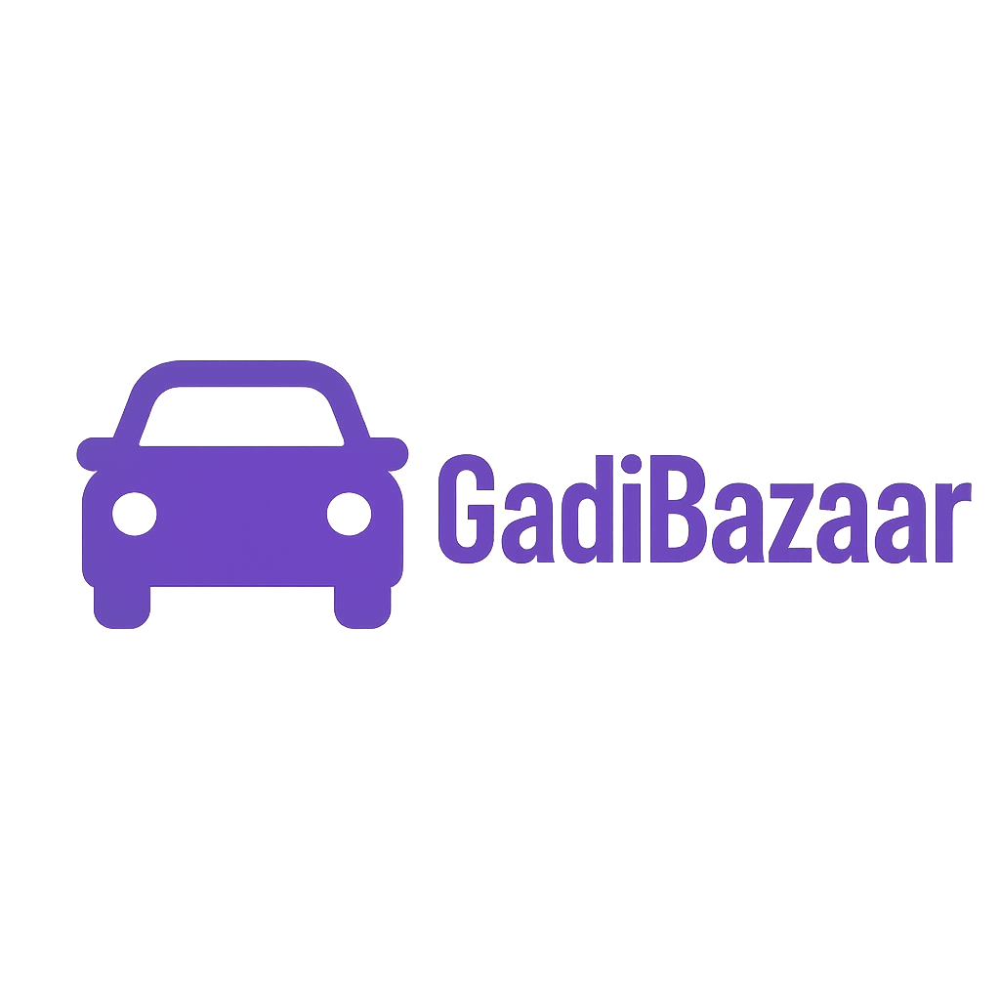

# GadiBazaar

<div align="center">
  
  
  **Premium Car Sales Platform for Nepal**
  
  [](https://reactjs.org)
  [](https://typescriptlang.org)
  [](https://tailwindcss.com)
  [](https://vitejs.dev)
  [](LICENSE)
</div>

---

## Overview

GadiBazaar is Nepal's premier automotive marketplace, revolutionizing the car buying and selling experience with modern web technologies. Our platform connects car enthusiasts, dealers, and buyers across Nepal, providing a seamless, user-friendly interface for automotive transactions.

## Key Features

### Comprehensive Car Listings

- Advanced search and filtering system
- Detailed car specifications and history
- High-quality image galleries
- Price comparison tools

### Dealer Dashboard

- Inventory management system
- Sales analytics and insights
- Customer relationship management
- Performance tracking

### User Experience

- Personalized user profiles
- Wishlist and favorites
- Advanced search filters
- Mobile-responsive design

### Smart Features

- Secure authentication system
- Real-time notifications
- Dark/Light theme toggle
- Responsive floating navigation
- Interactive UI components

## Quick Start

### Prerequisites

- Node.js 18.0+
- npm or yarn package manager
- Modern web browser
- PHP 8.0+ (for backend)
- MySQL 5.7+ (for database)

### Installation

1. **Clone the repository**

   ```bash
   git clone https://github.com/your-username/gadibazaar.git
   cd gadibazaar
   ```

2. **Frontend Setup**

   ```bash
   cd project
   npm install
   npm run dev
   ```

3. **Backend Setup**

   ```bash
   cd ../php-backend
   # Configure database in config/database.php
   # Run setup-database.bat or setup-database.php
   ```

4. **Database Configuration**

   ```bash
   # Import the database schema
   mysql -u your_username -p < database_setup.sql
   ```

5. **Launch Application**
   ```
   Frontend: http://localhost:5173
   Backend API: http://localhost/php-backend
   ```

## Technology Stack

### Frontend Framework

- **React 18** - Modern component-based architecture
- **TypeScript** - Type-safe development
- **Vite** - Lightning-fast build tool

### Styling & UI

- **Tailwind CSS** - Utility-first CSS framework
- **Lucide React** - Beautiful icon library
- **Custom Components** - Reusable UI elements

### Backend & Database

- **PHP 8.0+** - Server-side logic
- **MySQL** - Database management
- **RESTful APIs** - Data communication

### Features & Functionality

- **Responsive Design** - Mobile-first approach
- **Component Architecture** - Modular and scalable
- **State Management** - Efficient data handling
- **Modern ES6+** - Latest JavaScript features

## Design Philosophy

GadiBazaar features a modern, clean design with:

- **Floating Navigation** - Glassmorphism design with backdrop blur
- **Gradient Themes** - Beautiful color transitions
- **Responsive Layout** - Seamless experience across devices
- **Interactive Elements** - Smooth animations and hover effects
- **Professional Typography** - Clean and readable fonts

## Development Team

<table align="center">
  <tr>
    <td align="center">
      <br />
      <sub><b>Ramohan</b></sub><br />
      <sub>Developer</sub><br />
      <small>Full-Stack Development • System Architecture • API Integration</small>
    </td>
    <td align="center">
      <br />
      <sub><b>Namrata</b></sub><br />
      <sub>Developer</sub><br />
      <small>Frontend Development • UI/UX Design • Component Architecture</small>
    </td>
  </tr>
</table>

## Performance Metrics

### Frontend Performance

- Lightning-fast loading with Vite
- 100% mobile responsive
- Optimized component rendering
- Smooth page transitions

### User Experience

- Modern glassmorphism design
- Dark/Light theme support
- Interactive dashboards
- Advanced search capabilities

### Code Quality

- TypeScript for type safety
- Modular component architecture
- Clean code principles
- ESLint and Prettier configured

## Available Scripts

### Frontend (React)

| Command           | Description              |
| ----------------- | ------------------------ |
| `npm run dev`     | Start development server |
| `npm run build`   | Build for production     |
| `npm run preview` | Preview production build |
| `npm run lint`    | Run ESLint               |

### Backend (PHP)

| Script                | Description                  |
| --------------------- | ---------------------------- |
| `start-server.bat`    | Start PHP development server |
| `setup-database.bat`  | Initialize database          |
| `test-connection.php` | Test database connection     |

## API Endpoints

| Endpoint               | Method | Description                  |
| ---------------------- | ------ | ---------------------------- |
| `/cars.php`            | GET    | Retrieve car listings        |
| `/add-car.php`         | POST   | Add new car listing          |
| `/search-cars.php`     | GET    | Search cars with filters     |
| `/get-car-details.php` | GET    | Get detailed car information |
| `/login.php`           | POST   | User authentication          |
| `/register.php`        | POST   | User registration            |

## Browser Support

- Chrome (latest)
- Firefox (latest)
- Safari (latest)
- Edge (latest)
- Mobile browsers

## System Requirements

### Frontend

- Node.js 18.0 or higher
- npm 8.0 or higher
- Modern web browser with ES6 support

### Backend

- PHP 8.0 or higher
- MySQL 5.7 or higher
- Apache/Nginx web server
- 512MB RAM minimum

## Contributing

We welcome contributions to GadiBazaar! Here's how you can help:

1. Fork the repository
2. Create your feature branch (`git checkout -b feature/AmazingFeature`)
3. Commit your changes (`git commit -m 'Add some AmazingFeature'`)
4. Push to the branch (`git push origin feature/AmazingFeature`)
5. Open a Pull Request

### Development Guidelines

- Follow TypeScript best practices
- Write clean, documented code
- Test your changes thoroughly
- Follow existing code style
- Update documentation as needed

## License

This project is licensed under the MIT License - see the [LICENSE](LICENSE) file for details.

## Security

### Authentication

- Secure password hashing
- Session management
- Input validation and sanitization
- SQL injection prevention

### Data Protection

- Encrypted data transmission
- Secure file uploads
- User privacy protection
- GDPR compliance considerations

## Acknowledgments

- React community for the amazing framework
- Tailwind CSS team for the utility-first CSS approach
- Lucide team for beautiful icons
- Vite team for the blazing-fast build tool
- Nepal's automotive community for inspiration
- Open source contributors worldwide

## Contact & Support

For questions, suggestions, or support:

- Create an issue on GitHub
- Contact the development team
- Check documentation and FAQ

---

<div align="center">
  <i>© 2024 GadiBazaar. All rights reserved.</i>

</div>
